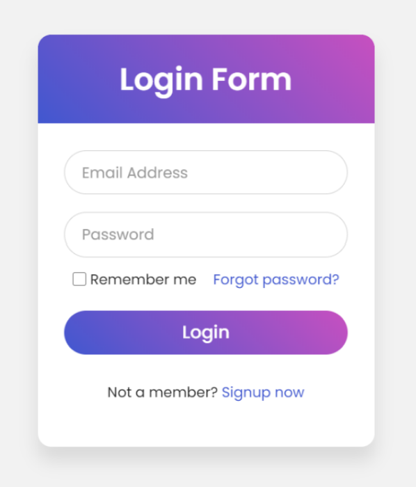

# login-form-ui
A simple and responsive login form UI built using HTML and CSS with a modern gradient design.

# Login Form UI

This is a simple and beautiful login form UI built using HTML and CSS. It features a gradient header, rounded input fields, and a clean layout.

## 🛠️ Technologies Used

- HTML5
- CSS3

## 💡 Features

- Gradient background on header and button
- Responsive and centered layout
- "Remember me" checkbox and "Forgot password?" link
- "Sign up now" call-to-action

## 📸 Preview

## Folder Structure 

login-form-ui/
│
├── index.html
├── style.css
├── LoginForm_Task.png
└── README.md

## 🧾 How to Run

1. Clone the repository:

git clone https://github.com/Vrushabh-Kun-Dev/login-form-ui.git

2. Open `index.html` in your browser.

